# Computer_Networks
 计算机网络期末复习资料

实验报告及工程文件

一、实验目的和和主要仪器设备
1、	实验目的：
（1）	掌握华为企业网络仿真平台（eNSP）软件的安装、设备注册、设置和使用。
（2）	掌握利用eNSP创建网络拓扑的方法。
（3）	掌握交换机的基本配置命令和数据报文采集的方法。
（4）	具备构建交换式以太网、进行网络测试和排错的基本能力。
2、	主要仪器设备：
（1）	一台连入互联网的Microsoft Windows10的主机。
（2）	华为eNSP软件、ping、Wireshark。

二、任务要求
1、	华为企业网络仿真平台 (eNSP)软件的安装与使用实验
（1）	下载和安装eNSP
（2）	启动和设置eNSP
2、	简单交换式以太网的实现
（1）	组建交换式以太网
（2）	数据报文的采集与分析
三、实验步骤
1、	华为企业网络仿真平台 (eNSP)软件的安装与使用实验
（1）	下载和安装eNSP
	下载eNSP
eNSP有多个版本。本书实验使用的版本为eNSP V100R003C00SPC100。可以从华为官网或其他渠道下载安装文件。安装eNSP。
	安装eNSP。
将下载得到的eNSP V100R003C00SPC100 Setup.zip解压到指定目录，双击指定目录中的 eNSP_Setup.exe， 开始安装eNSP。选择安装语言，单击“确定”按钮进入安装向导，按向导的提示进行操作。

（2）	启动和设置eNSP
	启动eNSP。
eNSP对运行环境的配置有要求，只有达到最低配置标准才能正常运行。从桌面或菜单启动eNSP。如果安装成功，系统将显示eNSP主界面。
	注册网络设备。
为了实现模拟环境与真实设备的相似性，eNSP需要在VirtualBox 中注册安装网络设备的虚拟主机，在VirtualBox的虚拟主机中加载网络设备的VRP文件，从而实现网络设备的模拟。
在主菜单区选择“菜单”→“工具”→“注册设备”命令，将弹出“注册”设备对话框。在对话框右侧，选择“AR_Base”“AC_Base“AP_Base”“AD_Base”“SAP_Base”选项，然后单击“注册”按钮，完成网络设备的注册。
	eNSP设置。
在主菜单区选择“菜单”→“工具”→“选项”命令将弹出“选项”对话框。在该对话框中，可以对界面、命令行、字体、多机eNSP的服务器和Wireshark、 VirtualBox 等工具进行设置。
	熟悉eNSP常用命令。
关于如何使用和操作eNSP，请参考eNSP帮助。按F1键，或在主菜单区选择“菜单”→“帮助”→“目录”命令，可以打开eNSP帮助。eNSP中的PC、笔记本STA和手机等模拟器、交换机与路由器所支持的常用调试命令。

2、	简单交换式以太网的实现
（1）	组建交换式以太网
步骤一	创建拓扑
	启动eNSP。
	单击工具栏中的“新建拓扑”图标。
	向工作区中添加1台S5700交换机。在网络设备区中选择交换机，在下方显示的设备中选择S5700交换机，将其拖入工作区。
	向空白工作区中添加2台PC。在网络设备区中选择计算机，在下方显示的设备中选择PC，将其拖入工作区。重复上述步骤，将第2台PC拖入工作区。
	将PC连接到交换机的指定端口。在网络设备区中选择连接线，在下方显示的连接线中选择铜线（Copper）。将鼠标移入工作区，此时鼠标形状变为气，进入连线状态。在PC-1上单击鼠标左键，在弹出的接口列表中选择接口GE 0/0/1，然后将鼠标移动到交换机上，单击鼠标左键，在弹出的交换机端口列表中选择端口GE 0/0/11，这样就完成了PC-1与交换机指定端口的连接；用同样方法将PC-2连接到交换机指定端口。单击鼠标右键或按键盘上的Esc键，即可退出连线状态。若连线错误，将鼠标移动到连接上，当连接线变为蓝色时，单击鼠标右键，从出现的快捷菜单中选择“删除连接”命令即可删除该连接线。
	为交换机和PC命名。在交换机和PC的名称上单击鼠标左键，将它们的名称修改为指定名称。
步骤二	为PC配置IPv4地址和子网掩码
	分别双击PC-1和PC-2，在各自弹出的配置窗口中选中“基础配置”标签，为其配置IPv4地址和子网掩码。
	为便于后续实验复用该拓扑，配置完毕后，单击工具栏中的“保存”图标，将拓扑保存到指定目录，将文件命名为lab-2.2.1-SimpleEthernet.topo。
步骤三	启动设备
单击工具栏中的“开启设备”图标，启动全部设备。
步骤四	测试验证
待全部设备都启动成功后，分别双击PC-1和PC-2，在弹出的配置窗口中选中“命令行”标签。分别在PC-1和PC-2的命令窗口中输入以下命令，查看2台PC的IP地址，测试它们能否相互通信。
步骤五	检查ARP Cache
	分别在PC-1和PC-2的命令窗口中输入以下命令，清除2台PC的ARP Cache内容。
	在PC-1命令窗口中输入以下命令，显示ARP Cache内容。

（2）	数据报文的采集与分析
步骤一	加载拓扑
启动eNSP，单击工具栏中的“打开文件”图标，加载实验2.2.1的拓扑文件lab-2.2.1-SimpleEthernet.topo。
步骤二	启动设备
单击工具栏中的“开启设备”图标，启动全部设备。
步骤三	开启数据抓包
用鼠标右键单击拓扑中的S5700交换机LSW1的图标，在弹出的菜单中选择“数据抓包”选项，然后选择端口，例如选择端口GE0/0/11，启动该端口的数据报文抓取和分析。开启了数据抓包的端口的指示灯在连接线上和在 eNSP的端口列表中将变为蓝色。用同样方法，也可以开启PC接口的数据抓包。
步骤四	抓取ping命令通信的数据包
双击连接在端口  GE  0/0711上的PC-1，在弹出的配置窗口中选中“命令行”标签，在命令窗口中输入以下命令。
步骤五	协议分析
用鼠标右键单击正在采集报文的交换机LSW1的图标，从出现的快捷菜单中选择“数据抓包”选项，选择开启数据抓包的端口，则停止端口对数据报文的抓取。
四、实验结果
1、	华为企业网络仿真平台 (eNSP)软件的安装与使用实验

（1）	下载和安装eNSP

 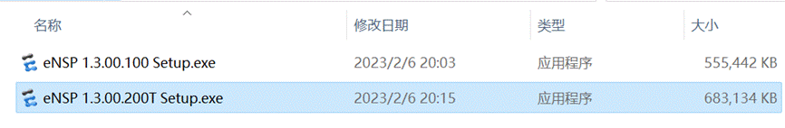

  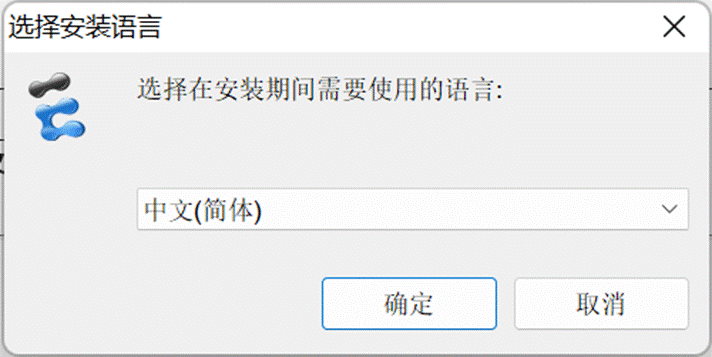                    （

（2）	启动和设置eNSP

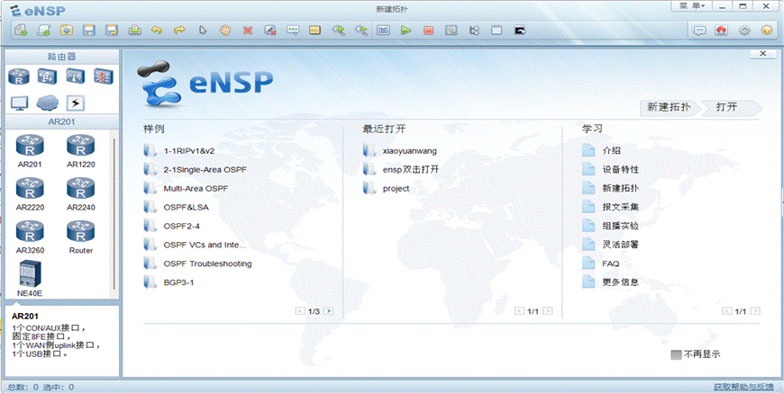  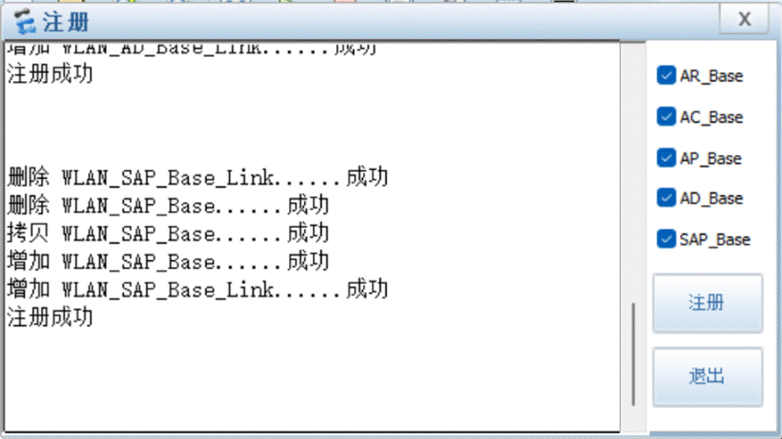

​              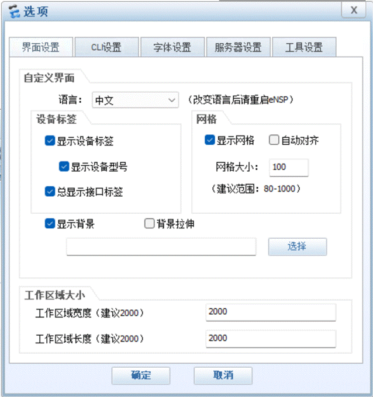

2、	简单交换式以太网的实现
（1）	组建交换式以太网

  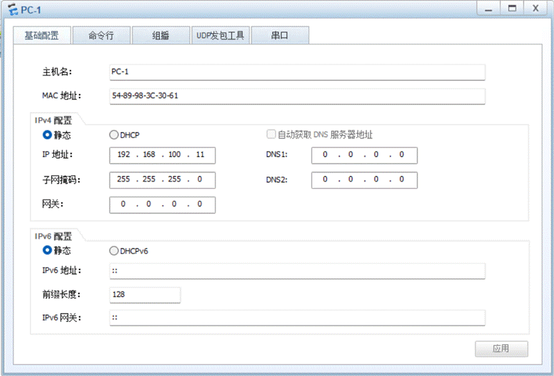 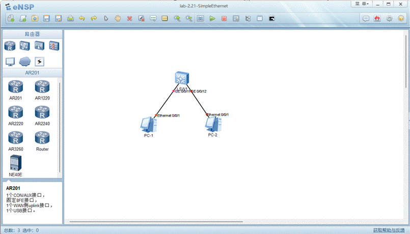  

 

 

（2）	数据报文的采集与分析 
   **2、**     **简单交换式以太网的实现**  （1）       组建交换式以太网  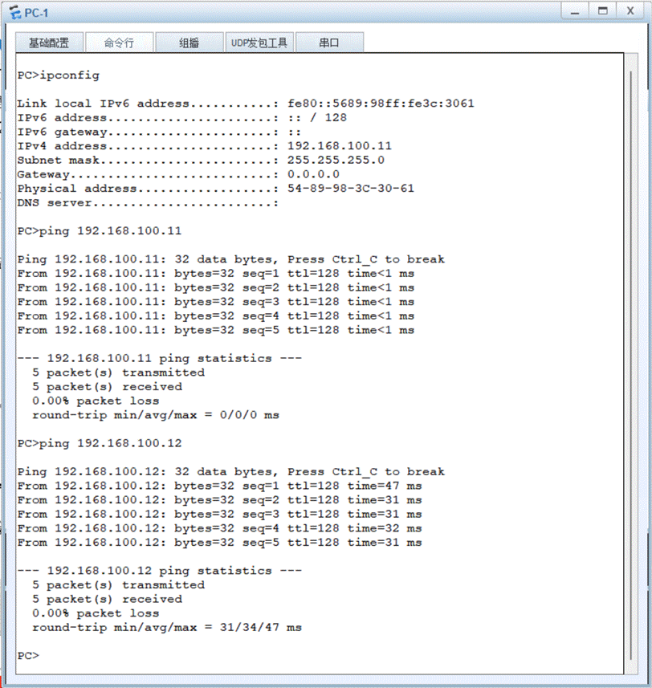  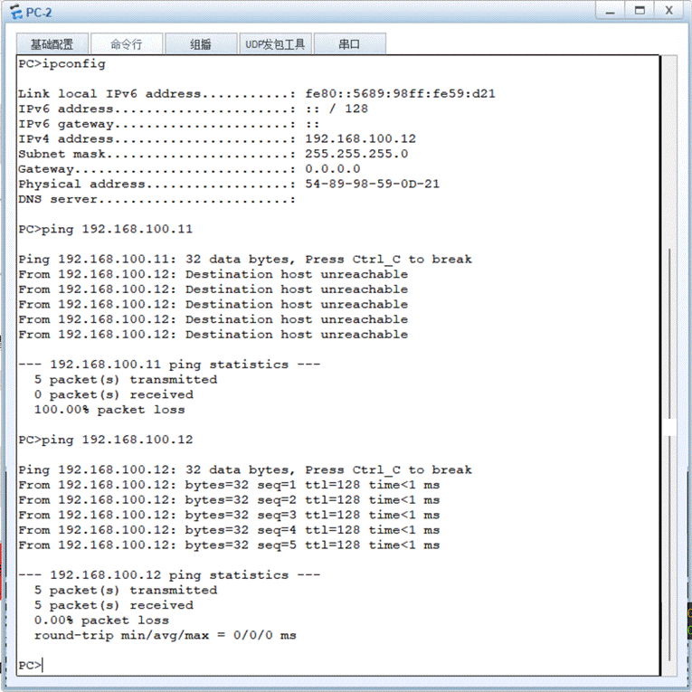  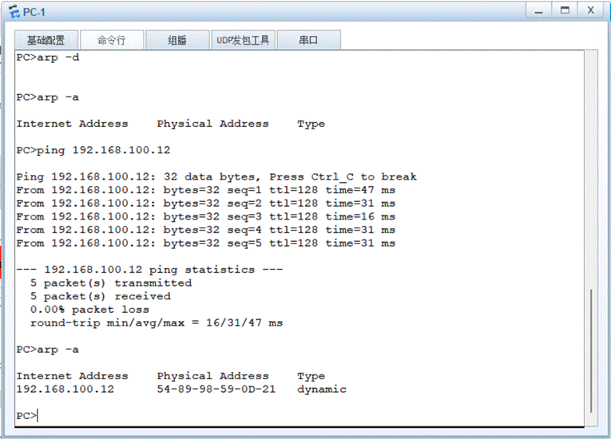  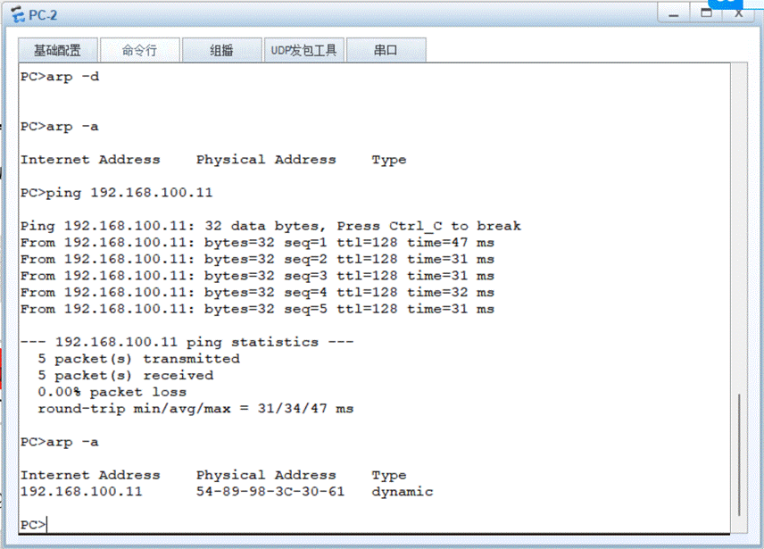     （2）       数据报文的采集与分析  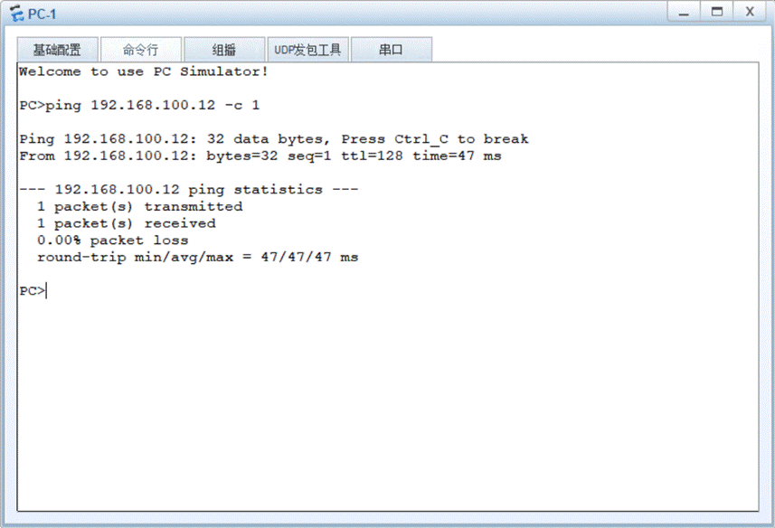  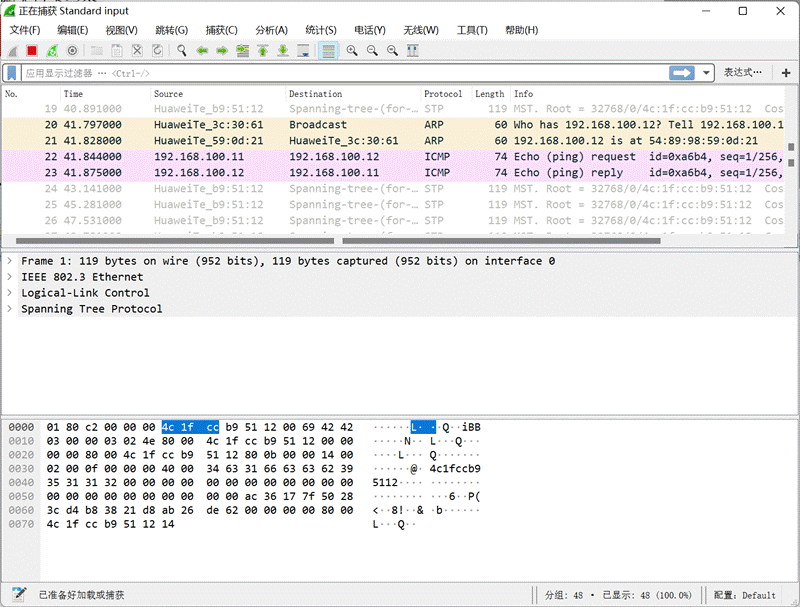  
